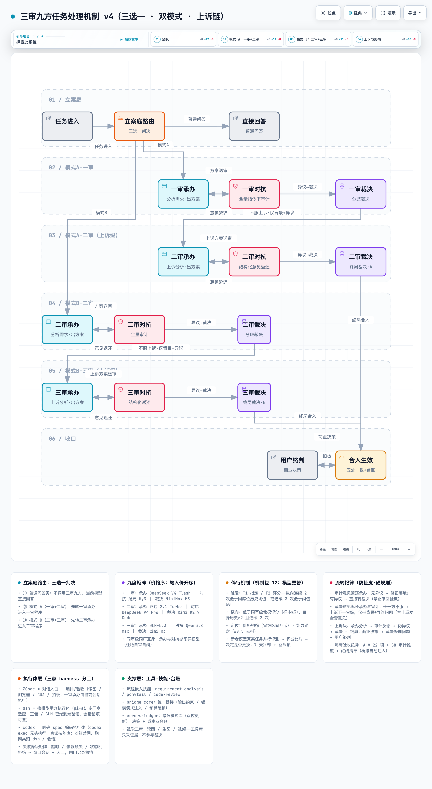

# Sanjiu Core · 三审九方

> **多智能体对抗式审计与治理结构**（Multi-Agent Adversarial Audit & Governance）—— 用 9 个异构模型席位组成三级交叉审查流水线，消灭单一模型直接产出带来的幻觉、自证与平庸共识，并在保证质量的前提下压缩多模型协作成本。

[](LICENSE)



> 交互版机制图：克隆后在浏览器打开 `docs/mechanism-v4/三审九方机制图-v4.html`（深/浅主题 + 四个视图）。

## 目录

- [缘起](#缘起)
- [解决什么问题](#解决什么问题)
- [项目作用与边界](#项目作用与边界)
- [核心特性](#核心特性)
- [快速开始](#快速开始)
- [仓库结构](#仓库结构)
- [术语表](#术语表)
- [质量与成本](#质量与成本)
- [FAQ](#faq)
- [贡献](#贡献)
- [许可证](#许可证)

## 缘起

围绕起诉、辩护、审判展开的司法程序，是人类文明为了抑制个体偏见与臆断、在效率与真相之间取得平衡的伟大创造。既然司法程序在人类社会中带来了如此广泛的益处，那么对于诞生于人类自然语言文明的人工智能协作，它同样可能发挥有效的作用。为此，我们参考司法程序的现实运作方式，提出了「三审九方」多智能体治理架构——需要说明的是，三审九方并非对司法程序的逐角色模仿，而是借鉴其核心理念：以对抗与裁决的程序约束，抑制单一主体在认知上的偏见与臆断。在设计上，它与学术界、业界热议的多智能体辩论（multi-agent debate）、反思—修正（self-refine）等思路彼此印证，可以视为对这类协同模式的一种工程化实践，并在我们自己的项目开发中持续落地。因此，我们尝试将其整理并公开，希望帮助更多朋友更好地使用 AI，也诚恳期待大家的批评与建议，一起探索更好的智能体协作架构。

## 解决什么问题

在多模型协作的真实开发中，四个问题反复出现，且单靠"换更强的模型"无法解决：

| 问题表现 | 后果 | 本项目的对应机制 |
|---|---|---|
| **幻觉**：模型凭空编造文件名、路径、数字 | 产出看似完整、实则不可信 | 审计输入强制携带事实件，材料包 schema 校验（缺字段拒绝流转） |
| **自证**：同一个模型既写产出又审自己 | 错误永远放行 | 承办与对抗**必须异模型**（同审级同厂互斥），九席交叉审查 |
| **庸俗一致**：多轮迭代收敛到同一个错误 | 审计形同虚设 | 修订版方案制：审计直接给出修改版方案，裁决一次敲定，禁止来回拉扯 |
| **流程失序**：路由靠自觉、扯皮无上限、纪律无人执行 | 机制沦为纸面约定 | 立案庭三选一路由 + 每级对抗≤1轮/裁决≤1轮/上诉仅1次硬计数（超限熔断转人工）+ 回执闸门 |

## 项目作用与边界

**作用**：给多模型协作团队提供一套**审计硬规则层**——九席交叉审查 + 流程闸门，让每一份产出都可追溯、每一次分歧都有终局。

**边界**：本项目不训练模型、不做评测榜单；它是把既有模型组织起来的**流程与工具层**（模型本身由各厂商 API 提供）。

## 核心特性

| 特性（对外名） | 用户收益 | 机制术语 |
|---|---|---|
| **三层九席交叉审查** | 任一产出必经"承办→对抗→裁决"，且三者异模型，杜绝自审 | 三审九方矩阵 |
| **智能分流路由** | 简单问答不空转、常规任务走轻量链、高风险任务走完整链 | 立案庭三选一（直答 / 模式A 一审+二审 / 模式B 二审+三审） |
| **修改版方案审计** | 审计不甩问题清单，直接交修改版方案，一轮敲定 | 修订版方案制 |
| **防扯皮硬限制** | 每级对抗、裁决各 1 轮、上诉仅 1 次，超限自动熔断转人工 | 硬计数状态机 |
| **结构化材料包** | 七类流转包（方案/意见/响应/裁决/上诉/终判/回执）过 JSON Schema，格式不符直接拒绝 | 材料包校验 |
| **回执闸门** | 审计调用必须携带合法路由回执，绕路调用被桥接层拒绝 | 回执硬校验 |
| **多执行体分发** | 承办按席位自动分发到 ZCode / dsh / codex 执行，超时自动降级 | 三执行体分发 |
| **错误模式沉淀** | 每次真实事故固化为错误模式，审计时自动注入提醒 | errors-ledger |

## 快速开始

本仓库工具为独立 Python 脚本，**无需安装项目本身**；运行时依赖仅两个 PyPI 包（需 Python 3.9+）：

```bash
git clone https://github.com/silvrblt/sanjiu-core.git
cd sanjiu-core
pip install jsonschema pyyaml   # 仅两个运行时依赖

# ① 命令行启动页（项目介绍/两模式/九席矩阵/席位选择/API 配置向导）
python3 tools/onboard.py

# ② 流转状态机自测（21 项断言，无需任何 API key）
python3 tools/court/flow_gate.py --selftest
# 预期输出：共 21 项断言，失败 0

# ③ 三选一路由演示（签发回执）
echo '{"title": "演示任务", "type": "text_gen"}' > /tmp/demo-card.json
python3 tools/court/flow_gate.py --route /tmp/demo-card.json
# 预期输出：JSON 回执（receipt_id/combo/signature 等字段）

# ④ 承办分发器自测（6 项断言）
python3 tools/court/lead_dispatch.py --selftest
```

> 完整的九方审计桥接（hunyuan/doubao/deepseek/minimax/qwen/kimi/glm 七家 CLI）需要各厂商 API key 配置于环境变量，见 `tools/sanjiu-models.yaml`。

## 仓库结构

```
sanjiu-core/
├── AGENTS.md                  # 机制全文（唯一事实源）
├── docs/
│   ├── MECH-*.md              # 编号机制文件（E2E 验收 / 可运行性闸门 / 输出治理）
│   └── mechanism-v4/          # 交互式机制图 + 验收清单
├── tools/
│   ├── court/                 # 立案庭路由 + 流转状态机 + 承办分发器
│   │   ├── flow_gate.py       #   三选一判决 / 硬计数 / 回执签发与闸门
│   │   ├── lead_dispatch.py   #   ZCode / dsh / codex 三执行体分发
│   │   └── schemas/           #   七类材料包 JSON Schema
│   ├── bridge_core.py         # 多厂商审计桥接内核（输出约束/错误注入/预算硬顶）
│   └── sanjiu-models.yaml     # 九席模型/价格/调度唯一事实源
└── schema/                    # 数据文件 Schema（API 化预留）
```

## 术语表

| 术语 | 一句话解释 |
|---|---|
| 承办 | 负责分析需求、产出方案的席位 |
| 对抗审计 | 持全部原始材料、对承办产出挑错的席位（直接出修改版方案） |
| 裁决 | 对双方分歧做一次敲定的席位 |
| 立案庭 | 任务入口的路由器：判断任务走哪条审级链 |
| 上诉 | 对敲定方案不服时，只带"背景+异议问题"向上提一级 |
| 回执 | 立案庭签发的流转凭证，审计调用必须携带 |

## 质量与成本

三审九方的核心设计主张：**通过分级路由、任务书（材料包）等机制规划，设计目标为在质量可接受的前提下显著压缩多模型协作成本。**

> 以下为设计目标与部分实测，**未完成全量成本回填验收**。具体落在四个机制上：

1. **分级路由**：简单问答不调用审计链（0 额外成本）；常规任务走轻量链（模式 A）；仅高风险任务（对外交付/资金/安全等）走完整链（模式 B）——**好钢用在刀刃上**；
2. **任务书制**：每次流转只传递结构化的必要材料（裁决只收分歧包、上诉只带背景+异议），而不是全量上下文来回搬运；
3. **前缀缓存**：多轮审计复用同一材料时命中厂商缓存——内部实测同材料连审第二次命中 **99.6%**（6272/6299，2026-08-27，原始记录暂存未公开；无复现脚本，不纳入对外质量/成本承诺）；
4. **价格序排席**：九个席位按输入价格升序排列，贵模型只放在低频审级（调度策略）。

### 路由档调用轮次对比

| 路由档 | 调用轮次（区间） | 调用构成（席位） | 适用任务 | 质量保障 |
|---|---|---|---|---|
| 直答 | 0 | 无（当前模型直接回答） | 问答、翻译、闲聊 | — |
| 模式 A | 2–6 | 最短 2（一审承办+对抗）；有异议 +1（一审裁决）；再不服上诉二审 +3（承办/对抗/裁决） | 常规开发/分析任务 | 两级异模型审查 |
| 模式 B | 2–6 | 最短 2（二审承办+对抗）；有异议 +1（二审裁决）；再不服上诉三审 +3（承办/对抗/裁决） | 对外交付/资金/法律/安全 | 最高级审查+终局裁决 |

> 成本测算口径：实际成本 = 轮次 × 所选模型单价（九席价格序见 `tools/sanjiu-models.yaml`）；轮次区间下限为无异议最短路径、上限为含上诉级最长路径。成本压缩为**设计目标**（内部成本台账以月 ¥1,880 → ≤¥700 为目标持续回填验收中）。

## FAQ

**Q：它是什么形态？** 一套机制规范 + 一组 Python 工具（状态机/桥接/分发），不是框架也不是平台——你可以把它的流程嫁接到任何多模型工作流里。

**Q：必须用指定的九个模型吗？** 九席是参考配置（`tools/sanjiu-models.yaml` 可换模型）；机制本身不绑定厂商，另有伴行机制（机制包 12）定义模型替换的评分流程。

**Q：单文件小改动也要走全流程吗？** 不需要——立案庭三选一：简单问答直接回答，常规任务走轻量链，只有高风险任务走完整链。

**Q：必须安装 ZCode / dsh / codex 三个执行体吗？** 不必。三执行体按角色理解：ZCode 指「承载编排与验收的会话入口」（任何智能体会话均可承担，非特定产品）；我们选择 ZCode 作为默认入口的原因之一，是它在**远程操作管理上的便捷性**（多会话/多工作区集中管理与远程主机托管）；dsh（换模型承办）与 codex（沙箱编码）为增强执行体。核心机制（桥接 CLI / 流转状态机 / 路由分发器）为纯 Python 独立脚本（Python 3.9+，依赖 `jsonschema` 与 `PyYAML` 两个 PyPI 包），不安装任何 harness 也能运行——承办由你当前对话的模型承担。dsh 与 codex 缺失或有故障时，分发器自动结构化降级：二进制缺失（MISSING_BINARY）/ 无执行权限（PERMISSION_DENIED）/ 启动失败（OSERROR）/ 超时——四类路径均降级到「当前会话 + 人工」并留痕可查。

**Q：为什么叫"三审九方"？** 三个审级 × 三个角色（承办/对抗审计/裁决）= 九个模型席位。

## 贡献

见 [CONTRIBUTING.md](CONTRIBUTING.md)（贡献通道、错误模式提报、PR 规范）。项目源于真实的多模型协作场景，历史文档中可能保留早期术语，以本 README 为准。

## 许可证

[MIT](LICENSE) © 2026 silvrblt
